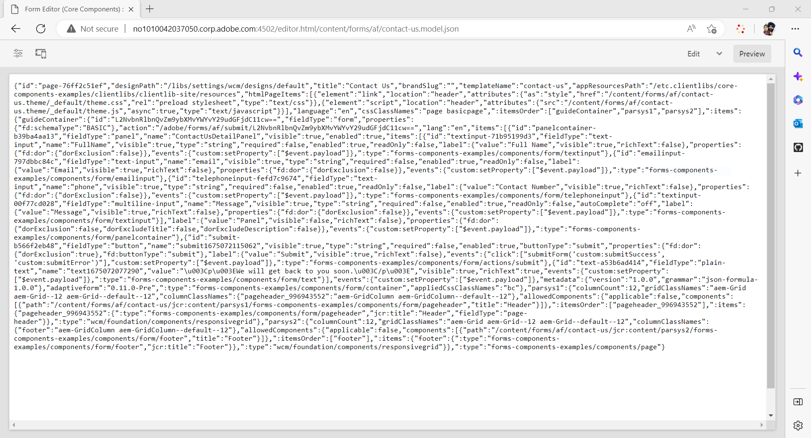

# Creare un modulo adattivo headless tramite l’editor Forms adattivo {#create-a-headless-adaptive-form-using-adaptive-forms-editor}

AEM Forms as a Cloud Service offre un editor intuitivo per la creazione di Forms adattivi headless. Con oltre 24 componenti core disponibili, puoi creare facilmente un modulo trascinando e rilasciando i componenti nell’editor. Inoltre, l’editor delle regole ti consente di aggiungere convalide ai campi del modulo.

>[!NOTE]
>
> 
>Se hai poca esperienza con Headless Adaptive Forms, l’Adobe consiglia di esaminare [Creare e pubblicare un modulo headless con kit di avvio](create-and-publish-a-headless-form.md) tutorial per apprendere le nozioni di base e creare un modulo adattivo headless prima di utilizzare l’editor Forms adattivo per moduli headless.

Per creare un modulo adattivo headless tramite l’editor Forms adattivo, effettua le seguenti operazioni:

## Prima di iniziare:

Per creare un modulo adattivo utilizzando l’editor di Forms adattivo è necessario quanto segue:

**Per AEM 6.5 Forms:**

* Accesso a un’istanza di Forms Author di AEM 6.5.16.0 o successiva.

* Componenti core dei moduli adattivi

* Modello per componenti core Forms adattivi

* Un tema per moduli adattivi per modello basato su Componenti core

* Aggiungi i tuoi utenti a [!DNL forms-users] gruppo. I membri del gruppo [!DNL forms-users] dispongono delle autorizzazioni per creare un modulo adattivo.

**Per AEM Forms as a Cloud Service:**

* Accesso a un [Istanza di authoring as a Cloud Service di AEM Forms](https://experienceleague.adobe.com/docs/experience-manager-cloud-service/content/forms/setup-configure-migrate/setup-forms-cloud-service.html?lang=en) o un [SDK as a Cloud Service AEM Forms locale](https://experienceleague.adobe.com/docs/experience-manager-cloud-service/content/forms/setup-configure-migrate/setup-local-development-environment.html?lang=en) ambiente.

* **Un modello di modulo adattivo**: un modello fornisce una struttura di base e definisce l’aspetto (layout e stili) di un modulo adattivo. Include componenti preformattati contenenti determinate proprietà e struttura del contenuto. Fornisce inoltre le opzioni per definire un tema e un’azione di invio. Il tema definisce l’aspetto, mentre l’azione di invio definisce l’azione da intraprendere al momento dell’invio di un modulo adattivo. Ad esempio, l’invio dei dati raccolti a un’origine dati. Il Cloud Service fornisce un modello OOTB, denominato vuoto:

   * Il modello `blank Adaptive Forms (Core Components)` è incluso in ogni nuovo programma AEM Forms as a Cloud Service.
   * È inoltre possibile [creare un nuovo modello di Forms adattivo (Componenti core)](https://experienceleague.adobe.com/docs/experience-manager-cloud-service/content/forms/adaptive-forms-authoring/authoring-adaptive-forms-foundation-components/create-an-adaptive-form-on-forms-cs/template-editor.html) da zero.

* **Un tema per moduli adattivi**: un tema contiene dettagli sullo stile dei componenti e dei pannelli. Gli stili includono proprietà quali i colori di sfondo, i colori degli stati, la trasparenza, l’allineamento e le dimensioni. Quando applichi un tema, lo stile specificato si riflette sui componenti corrispondenti.  Il modello `Canvas` è incluso in ogni nuovo programma AEM Forms as a Cloud Service.

* **Autorizzazioni**: aggiungi gli utenti a un gruppo [!DNL forms-users]. I membri del gruppo [!DNL forms-users] dispongono delle autorizzazioni per creare un modulo adattivo. Per un elenco dettagliato dei gruppi di utenti specifici per i moduli, consulta [Gruppi e autorizzazioni](https://experienceleague.adobe.com/docs/experience-manager-cloud-service/content/forms/setup-configure-migrate/forms-groups-privileges-tasks.html).

## Creare un modulo adattivo  {#create-an-adaptive-form-components}

1. Accedi al tuo [!DNL Experience Manager Forms] Istanza Autore.

1. Inserisci le credenziali nella pagina di accesso di Experience Manager. Dopo aver effettuato l’accesso, nell’angolo in alto a sinistra tocca **[!UICONTROL Adobe Experience Manager]** > **[!UICONTROL Moduli]** > **[!UICONTROL Moduli e documenti]**.

1. Tocca **[!UICONTROL Crea]**  > **[!UICONTROL Moduli adattivi]**. Viene aperta la procedura guidata. Nella scheda Sorgente, seleziona un modello:

   

   Quando selezioni un modello, vengono selezionati automaticamente un tema e un’azione di invio specificati nel modello, mentre viene abilitato il pulsante **[!UICONTROL Crea]**. È possibile passare alle schede **[!UICONTROL Stile]** o **[!UICONTROL Invio]** per selezionare un tema o un’azione di invio diversi. Se il modello selezionato non specifica un tema, il pulsante Crea rimane disabilitato. È possibile passare alla scheda **[!UICONTROL Stili]** per selezionare manualmente un tema.

1. Nella scheda **[!UICONTROL Stile]**, seleziona un tema:

   * Quando il modello selezionato specifica un tema, lo stesso viene selezionato automaticamente nella procedura guidata. È possibile inoltre scegliere un tema diverso dalla scheda Stile.

   * Se il modello selezionato non specifica un tema, è possibile utilizzare la scheda Stile per sceglierne uno. Il pulsante **[!UICONTROL Crea]** viene abilitato solo dopo la selezione di un tema.

1. (Facoltativo) Nella scheda Dati, seleziona un modello dati:

   * **Modello dati modulo**: un [Modello dati modulo](https://experienceleague.adobe.com/docs/experience-manager-cloud-service/content/forms/integrate/use-form-data-model/data-integration.html) consente di integrare entità e servizi da diverse origini dati a un modulo adattivo. Scegli Modello dati modulo se il modulo adattivo che si sta creando prevede il recupero e la scrittura di dati da e verso più origini dati.

   * **Schema JSON**: [Schema JSON](https://experienceleague.adobe.com/docs/experience-manager-cloud-service/content/forms/adaptive-forms-authoring/authoring-adaptive-forms-foundation-components/create-an-adaptive-form-on-forms-cs/adaptive-form-json-schema-form-model.html?lang=en) I moduli adattivi consentono l’integrazione diretta con il sistema back-end dell’organizzazione grazie alla possibilità di associare uno schema JSON, che rappresenta la struttura dei dati prodotti o utilizzati. Questa associazione consente agli autori di aggiungere contenuti al modulo adattivo in modo dinamico, utilizzando gli elementi dello schema. Gli elementi dello schema sono accessibili facilmente della scheda Oggetti modello dati del Browser dei contenuti, durante il processo di authoring e tutti i campi vengono aggiunti automaticamente a qualsiasi nuovo modulo adattivo creato.

   Per impostazione predefinita, tutti i campi dello schema JSON associato vengono selezionati e convertiti automaticamente nei componenti corrispondenti del modulo adattivo, semplificando il processo di authoring. La procedura guidata offre l’ulteriore comodità di consentire la scelta selettiva dei campi da includere nel modulo adattivo tramite l’utilizzo di caselle di controllo.

1. Nella scheda **[!UICONTROL Invio]**, seleziona un’azione di invio:

   * Quando selezioni un modello, l’azione di invio specificata in quel modello viene selezionata automaticamente. Dalla scheda Invio puoi selezionare un’azione di invio diversa. La scheda **[!UICONTROL Invio]** mostra tutte le azioni di invio disponibili.

   * Se nel modello selezionato non è specificata un’azione di invio, è possibile utilizzare la scheda **[!UICONTROL Invio]** per selezionarne una.

1. (Facoltativo) Nella scheda **[!UICONTROL Consegna]**, è possibile specificare una data di pubblicazione o di annullamento della pubblicazione per un modulo adattivo.

1. Tocca **[!UICONTROL Crea]**. Viene visualizzata una finestra di dialogo che specifica il titolo, il nome e la posizione in cui salvare il modulo adattivo:

   * **[!UICONTROL Titolo]**: specifica il nome visualizzato del modulo. Il titolo consente di identificare il modulo nell’interfaccia utente di [!DNL Experience Manager Forms].
   * **[!UICONTROL Nome:]** specifica il nome del modulo. Nell’archivio viene creato un nodo con il nome specificato. Quando si inizia a digitare un titolo, il valore del campo nome viene generato automaticamente. Puoi modificare il valore suggerito. Il campo nome può contenere solo caratteri alfanumerici, trattini e caratteri di sottolineatura. Tutti gli input non validi vengono sostituiti da un trattino.
   * **[!UICONTROL Percorso:]** specifica la posizione in cui salvare il modulo adattivo. Puoi salvare il modulo adattivo direttamente all’indirizzo `/content/dam/formsanddocuments` o creare una cartella di salvataggio come `/content/dam/formsanddocuments/adaptiveforms`. Assicurati di creare la cartella prima di utilizzarla nel percorso. Il campo **[!UICONTROL Percorso]** non crea cartelle automaticamente.

1. Tocca **[!UICONTROL Crea]**. Viene creato un modulo adattivo che viene aperto nell’editor di moduli adattivi. L’editor mostra i contenuti disponibili nel modello.  In base al tipo di modulo adattivo, gli elementi del modulo presenti nello schema <!--XFA form template, XML schema or --> JSON associato o nel modello di dati del modulo vengono visualizzati nella scheda **[!UICONTROL Oggetti modello di dati]** del **[!UICONTROL Browser contenuti]** nella barra laterale. Puoi anche trascinare questi elementi per creare il modulo adattivo.

Ora è possibile trascinare i componenti di Forms adattivo nel contenitore di Forms adattivo per progettare e creare il modulo.

## Visualizzare il rendering JSON di un modulo adattivo {#preview-form}

Seleziona il modulo adattivo e tocca **Anteprima**. Viene visualizzata l&#39;anteprima del modulo. Per visualizzare la definizione del modulo (JSON), sostituisci l’estensione .html nell’URL con .model.json

Ad esempio, http://[author-server]:[porta]/editor.html/content/forms/af/contact-us.model.json

È possibile utilizzare il Forms adattivo headless [getForm](https://opensource.adobe.com/aem-forms-af-runtime/api/#tag/Get-Form-Definition) API per recuperare la definizione del modulo (JSON) e utilizzarla nell’applicazione.

