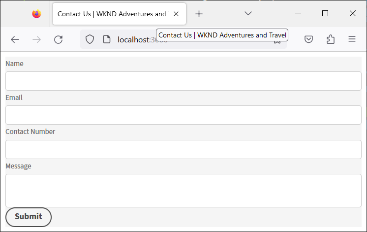

# Creare e visualizzare in anteprima un modulo headless tramite un’app React {#introduction}

Il kit di avvio ti aiuta a iniziare rapidamente a utilizzare un’app React. Puoi sviluppare e utilizzare moduli adattivi headless in un Angular, in Vanilla JS e in altri ambienti di sviluppo di tua scelta.

Iniziare a utilizzare moduli adattivi headless è molto semplice e rapido. Clona il progetto React pronto, installa le dipendenze ed esegui il progetto. Hai un modulo adattivo headless integrato in un’app React in esecuzione. Puoi utilizzare il progetto React di esempio per generare e testare moduli adattivi headless prima di distribuirli in un ambiente di produzione.

Iniziamo:

>[!NOTE]
>
>
> Questa guida introduttiva utilizza un’app React. Per utilizzare i moduli adattivi headless, puoi utilizzare la tecnologia o il linguaggio di programmazione che preferisci.

## Prima di iniziare {#pre-requisites}

Per creare ed eseguire un&#39;app React, è necessario che nel computer sia installato quanto segue:

* Installare [ultima versione di Git](https://git-scm.com/downloads). Se hai poca esperienza con Git, consulta [Installazione di Git](https://git-scm.com/book/en/v2/Getting-Started-Installing-Git).

* Installa [Node.js 16.13.0 o versione successiva](https://nodejs.org/it/download/). Se hai poca esperienza con Node.js, consulta [Come installare Node.js](https://nodejs.dev/en/learn/how-to-install-nodejs).

## Introduzione

Una volta soddisfatti i requisiti, eseguire i passaggi seguenti per iniziare:

1. [Configurare il kit di avvio per moduli adattivi headless](#setup)

1. [Anteprima del modulo adattivo headless incluso nel kit di avvio](#preview)

1. [Crea ed esegui il rendering del tuo modulo adattivo headless](#custom)


## 1. Configurare il kit di avvio per moduli adattivi headless {#install}

Il kit di avvio è un’app React con un modulo adattivo headless di esempio e le librerie corrispondenti. Utilizza il kit per sviluppare e testare i moduli adattivi headless e i corrispondenti componenti React. Esegui i seguenti comandi per configurare il kit di avvio per moduli adattivi headless:

1. Apri il prompt dei comandi ed esegui il comando seguente:

   ```shell
   git clone https://github.com/adobe/react-starter-kit-aem-headless-forms
   ```

   Il comando crea una directory denominata **react-starter-kit-aem-headless-forms** nella posizione corrente e clona l’app iniziale React dei moduli adattivi headless. Oltre alle configurazioni e all’elenco delle dipendenze necessarie per il rendering del modulo, la directory include i seguenti contenuti importanti:

   * **Modulo di esempio**: il kit di avvio include un modulo di richiesta di prestito di esempio. Per visualizzare il modulo (definizione modulo) incluso nell’app, apri la `/react-starter-kit-aem-headless-forms/form-definations/form-model.json` file.
   * **Componenti di reazione di esempio**: il kit di avvio include alcuni esempi di componenti di reazione per Testo formattato e Dispositivo di scorrimento. Questa guida ti aiuta a creare componenti personalizzati utilizzando questi componenti Testo formattato e Cursore.
   * **Mappings.ts**: il file mappings.ts consente di mappare i componenti personalizzati con i campi del modulo. Ad esempio, mappa un campo stepper numerico con il componente valutazioni.
   * **Configurazioni dell’ambiente**: le configurazioni dell’ambiente ti consentono di scegliere se eseguire il rendering di un modulo incluso nel kit di avvio o recuperare un modulo da un server AEM Forms.

   

   >[!NOTE]
   >
   > 
   > Esempi nei documenti sono basati su VSCode. Puoi utilizzare qualsiasi editor di codice di testo normale.


1. Accedi a **react-starter-kit-aem-headless-forms** ed eseguire il comando seguente per installare le dipendenze:

   ```shell
   npm install
   ```

   Il comando scarica tutti i pacchetti e le librerie necessari per eseguire e generare l’app, come le librerie di moduli adattivi headless (@aemforms/af-react-renderer, @aemforms/af-react-components, @adobe/react-spectrum), esegue le convalide e mantiene i dati per le istanze del modulo.

   


## 2. Anteprima del modulo adattivo headless {#preview}

Dopo aver configurato il kit di avvio, puoi visualizzare in anteprima il modulo adattivo headless di esempio e sostituirlo con un modulo personalizzato. Puoi anche configurare il kit di avvio per recuperare un modulo da un server AEM Forms. Per visualizzare l&#39;anteprima del modulo

1. Rinomina il `env_template` file in `.env` file. Inoltre, l&#39;opzione USE_LOCAL_JSON è impostata su true.

   

   <!-- The options in the .env file help you configure source of the forms definantion (.JSON):
    *  To source forms definantion (.JSON) from an AEM Server, set USE_LOCAL_JSON option to false, use the AEM_URL option to specify URL  of your AEM Server, and set the AEM_FORM_PATH option to path of your adaptive form.
    *  To source forms definantion (.JSON) form-model.json file included in the starter-kit, set USE_LOCAL_JSON option to false. -->

1. Utilizza il seguente comando per eseguire l’app:

   ```shell
     npm start
   ```


   Questo comando avvia un server di sviluppo locale e apre il modulo adattivo headless di esempio, incluso nell’app iniziale, nel browser Web predefinito.

   

   Voilà! Ora è tutto pronto per iniziare a sviluppare un modulo adattivo headless personalizzato.

   <!--  As you know, in a headless form the form data and logic are separate from the presentation layer and can be used by any client that can make HTTP requests, such as a mobile app, a static site, or a different web application. The form is often managed and stored on a server, which serves as the backend for the form. The client sends requests to the server to retrieve the form, submit data, and receive updated form data. This allows for greater flexibility and integration with different technologies. You can store and retrive a Headless adaptive form on an AEM Server  -->

## 3. Crea ed esegui il rendering del tuo modulo adattivo headless{#custom}

Un modulo adattivo headless rappresenta il modulo e i relativi componenti, come campi e pulsanti, in formato JSON (JavaScript Object Notation). Il vantaggio di utilizzare il formato JSON è che può essere facilmente analizzato e utilizzato da vari linguaggi di programmazione, rendendolo un modo pratico per scambiare dati modulo tra i sistemi. Per visualizzare il modulo adattivo headless di esempio incluso nell’app, apri la `/react-starter-kit-aem-headless-forms/form-definations/form-model.json` file.

Creiamo un modulo per contattarci con quattro campi: &quot;Nome&quot;, &quot;E-mail&quot;, &quot;Numero di contatto&quot; e &quot;Messaggio&quot;. I campi sono definiti come oggetti (elementi) all’interno del JSON e ogni oggetto (elemento) ha proprietà come tipo, etichetta, nome e obbligatorio. Il modulo ha anche un pulsante di tipo &quot;invia&quot;. Ecco JSON per il modulo.


```JSON
{
  "afModelDefinition": {
    "adaptiveform": "0.10.0",
    "items": [
      {
        "fieldType": "text-input",
        "label": {
          "value": "Name"
        },
        "name": "name"
      },
      {
        "fieldType": "text-input",
        "format": "email",
        "label": {
          "value": "Email"
        },
        "name": "email"
      },
      {
        "fieldType": "text-input",
        "format": "phone",
        "pattern": "[0-9]{10}",
        "label": {
          "value": "Contact Number"
        },
        "name": "Phone"
      },
      {
        "fieldType": "multiline-input",
        "label": {
          "value":"Message"
        },
        "name": "message"
      },
      {
        "fieldType": "button",
        "label":{
          "value": "Submit"
        },
        "name":"submit",
        "events":{
          "click": "submitForm()"
        }
      }
    ],
    "action": "https://eozrmb1rwsmofct.m.pipedream.net",
    "description": "Contact Us",
    "title": "Contact Us",
    "metadata": {
      "grammar": "json-formula-1.0.0",
      "version": "1.0.0"
    }
  }
}
```

>[!NOTE]
>
> * L&#39;attributo &quot;afModelDefinition&quot; è necessario solo per le applicazioni React e non fa parte della definizione del modulo.
> * Puoi creare a mano il modulo JSON o utilizzare il [Editor moduli adattivi AEM (editor WYSIWYG per moduli adattivi)](create-a-headless-adaptive-form.md) per creare e consegnare il modulo JSON. In un ambiente di produzione, si utilizza AEM Forms per distribuire il modulo JSON, per saperne di più in seguito.
> * L’esercitazione utilizza https://pipedream.com/ per verificare l’invio dei moduli. Per ricevere i dati da un modulo adattivo headless utilizzi endpoint personali o di terze parti approvati dall’organizzazione.


Per eseguire il rendering del modulo, sostituisci il modulo adattivo JSON headless di esempio `/react-starter-kit-aem-headless-forms/form-definations/form-model.json` con il JSON precedente, salva il file, aspetta che lo starter-kit compili e aggiorni il modulo.


<!-- Your form is ready. Let's add some validations and make "Name", "Email", and "Message" fields mandatory. -->

Il rendering del modulo adattivo headless è stato eseguito correttamente.


## Bonus

Imposta il titolo della pagina Web che ospita il modulo su `Contact Us | WKND Adventures and Travel`. Per modificare il titolo, aprire _react-starter-kit-aem-headless-forms/public/index.html_ file per la modifica e impostare il titolo.




## Passaggio successivo

Per impostazione predefinita, il kit di avvio utilizza [Spettro Adobe](https://spectrum.adobe.com/) componenti per il rendering del modulo. Puoi creare e utilizzare componenti personalizzati o di terze parti. Ad esempio, utilizzando l’interfaccia utente Materiale di Google o l’interfaccia utente Chakra.

Facciamo [utilizzare l’interfaccia utente Materiale di Google](use-google-material-ui-react-components-to-render-a-headless-form.md) per visualizzare il modulo Contattaci.


