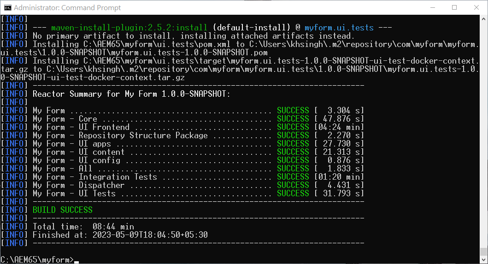

# Abilitare Headless Adaptive Forms sul Forms AEM 6.5 {#enable-headless-adaptive-forms-on-aem-65-forms}

Per abilitare Headless Adaptive Forms nell’ambiente Forms AEM 6.5, configura un progetto basato su AEM Archetype 41 o versione successiva e implementalo in tutte le istanze di Author e Publish.

Distribuendo il progetto basato su Archetipo AEM 41 o versione successiva nelle istanze di Forms AEM 6.5, è possibile: [creazione di componenti core basati su Adaptive Forms](create-a-headless-adaptive-form.md). Questi moduli sono rappresentati in formato JSON e utilizzati come Forms headful e headless adattivo, consentendo una maggiore flessibilità e personalizzazione in una serie di canali, tra cui app mobile, web e native.

## Prerequisiti {#prerequisites}

Prima di abilitare Headless Adaptive Forms nell’ambiente Forms AEM 6.5,

* [Aggiornamento a AEM 6.5 Forms Service Pack 16 (6.5.16.0) o versione successiva](https://experienceleague.adobe.com/docs/experience-manager-65/release-notes/aem-forms-current-service-pack-installation-instructions.html).

* Installa la versione più recente di [Apache Maven](https://maven.apache.org/download.cgi).

* Installa un editor di testo normale. Microsoft Visual Studio Code.

## Crea e implementa il progetto più recente basato su Archetipo AEM

Per creare un Archetipo AEM 41 o [più tardi](https://github.com/adobe/aem-project-archetype) basato su e distribuirlo a tutte le istanze Author e Publish:

1. Accedi al computer, hosting ed esecuzione dell’istanza Forms AEM 6.5, come amministratore.
1. Apri il prompt dei comandi o il terminale.
1. Esegui il seguente comando per creare un progetto basato su Archetipo 41 AEM:

   * Microsoft Windows

   ```Shell
      mvn -B org.apache.maven.plugins:maven-archetype-plugin:3.2.1:generate ^
      -D archetypeGroupId=com.adobe.aem ^
      -D archetypeArtifactId=aem-project-archetype ^
      -D archetypeVersion=41 ^
      -D appTitle="My Form" ^
      -D appId="myform" ^
      -D groupId="com.myform" ^
      -D includeFormsenrollment="y" ^
      -D aemVersion="6.5.15" 
   ```

   * Linux o Apple macOS

   ```Shell
      mvn -B org.apache.maven.plugins:maven-archetype-plugin:3.2.1:generate \
      -D archetypeGroupId=com.adobe.aem \
      -D archetypeArtifactId=aem-project-archetype \
      -D archetypeVersion=41 \
      -D appTitle="My Form" \
      -D appId="myform" \
      -D groupId="com.myform" \
      -D includeFormsenrollment="y" \
      -D aemVersion="6.5.15" 
   ```

   Quando esegui il comando di cui sopra, considera i seguenti punti:

   * Aggiorna il comando in modo che rifletta i valori specifici per l&#39;ambiente, inclusi appTitle, appId e groupId. Impostare inoltre i valori di includeFormsenrollment su &#39;y&#39;. Se si utilizza Forms Portal, impostare _includeExamples=y_ per includere nel progetto i componenti core di Forms Portal.

   * Non modificare &quot;aemVersion&quot; da 6.5.15.0 ad altro.

1. (Solo per progetti basati su Archetipo versione 41) Dopo la creazione del progetto Archetipo AEM, abilita i temi per Forms adattivo basato su Componenti core. Per abilitare i temi:

   1. Apri [Cartella progetto Archetipo AEM]/ui.apps/src/main/content/jcr_root/apps/__appId__/components/adaptiveForm/page/customheaderlibs.html per la modifica:

   1. Aggiungere il seguente codice alla riga 21:

      ```XML
      <sly data-sly-use.clientlib="core/wcm/components/commons/v1/templates/clientlib.html"
      data-sly-use.formstructparser="com.adobe.cq.forms.core.components.models.form.FormStructureParser"
      data-sly-test.themeClientLibRef="${formstructparser.themeClientLibRefFromFormContainer}">
      <sly data-sly-test="${themeClientLibRef}" data-sly-call="${clientlib.css @ categories=themeClientLibRef}"/>
      </sly>
      ```

      

   1. Salva e chiudi il file 

1. Aggiorna il progetto per includere la versione più recente dei Componenti core di Forms:

   1. Apri [Cartella progetto Archetipo AEM]/pom.xml per la modifica.
   1. Imposta versione di `core.forms.components.version` e `core.forms.components.af.version` a [Componenti core Forms più recenti](https://github.com/adobe/aem-core-forms-components/tree/release/650) versione.

      

   1. Salva e chiudi il file 


1. Dopo aver creato correttamente il progetto dell’Archetipo AEM, crea il pacchetto di distribuzione per il tuo ambiente. Per generare il pacchetto:

   1. Passa alla directory principale del progetto Archetipo AEM.


   1. Esegui il seguente comando per creare il progetto Archetipo AEM per il tuo ambiente:

      ```Shell
      mvn clean install
      ```

      


   Una volta creato correttamente il progetto dell’Archetipo AEM, viene generato un pacchetto AEM. Puoi trovare il pacchetto all’indirizzo [Cartella progetto Archetipo AEM]\all\target\[appid].all-[version].zip

1. Utilizza il [Gestione pacchetti](https://experienceleague.adobe.com/docs/experience-manager-65/administering/contentmanagement/package-manager.html?lang=it) per implementare [Cartella progetto Archetipo AEM]\all\target\[appid].all-[version].zip su tutte le istanze Author e Publish.

>[!NOTE]
>
>
>
>In caso di difficoltà durante l’accesso alla finestra di dialogo di accesso in un’istanza di pubblicazione per installare il pacchetto tramite Gestione pacchetti, prova ad accedere tramite il seguente URL: http://[URL server di pubblicazione]:[PORTA]/system/console. Questo ti consente di accedere all’istanza Publish e di procedere con il processo di installazione.


I Componenti core sono abilitati per il tuo ambiente. Nell’ambiente vengono distribuiti un modello modulo adattivo basato su Componenti core vuoto e un tema Canvas 3.0, che consente di: [creazione di componenti core basati su Adaptive Forms](create-a-headless-adaptive-form.md).

## Domande frequenti

### Cosa sono i Componenti core?

Il [Componenti core](https://experienceleague.adobe.com/docs/experience-manager-core-components/using/introduction.html?lang=it) sono un set di componenti WCM (Web Content Management) standardizzati per l’AEM che consentono di velocizzare i tempi di sviluppo e ridurre i costi di manutenzione dei siti web.

### Quali sono tutte le funzionalità aggiunte all’abilitazione dei componenti core?


Quando i componenti core Adaptive Forms sono abilitati per il tuo ambiente, all’ambiente vengono aggiunti un modello di modulo adattivo basato su Componenti core vuoto e un tema Canvas 3.0. Dopo aver abilitato i componenti core Forms adattivi per il tuo ambiente, puoi:

* Creazione di componenti core basati su Adaptive Forms.
* Creare modelli di moduli adattivi basati su Componenti core.
* Crea temi personalizzati per i modelli di moduli adattivi basati su Componenti core.
* Distribuisci le rappresentazioni JSON del modulo adattivo basato su componenti core a canali quali dispositivi mobili, web, app native e servizi che richiedono la rappresentazione headless di un modulo.
