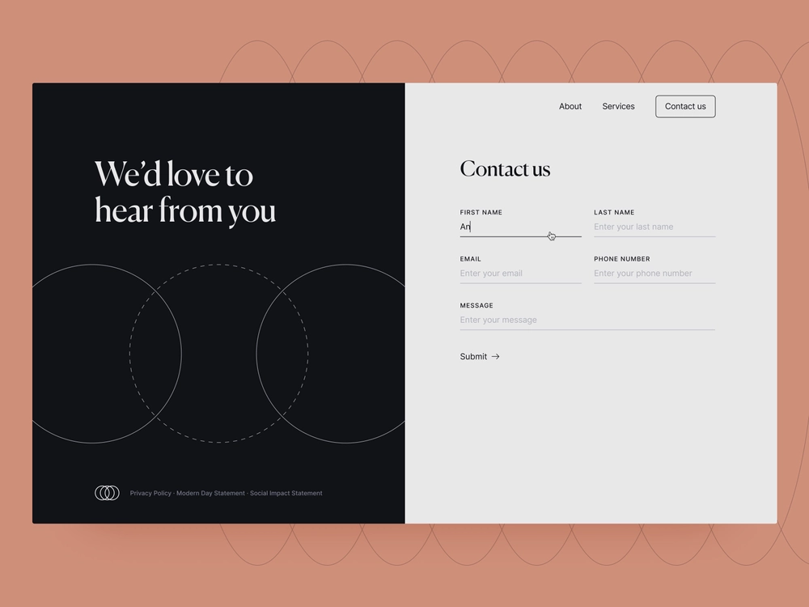

# Guida introduttiva di Headless Adaptive Forms

Questa esercitazione fornisce un framework end-to-end per creare un modulo adattivo headless. Il tutorial è organizzato in un caso d’uso e più guide. Ogni guida ti aiuta ad apprendere e aggiungere nuove funzioni al modulo adattivo headless creato in questa esercitazione. Hai un modulo adattivo headless funzionante dopo ogni guida. Al termine di questa esercitazione, sarai in grado di:

* Creare un modulo adattivo headless
* Aggiungere regole business al modulo
* Utilizza l’interfaccia utente dei materiali di Google per assegnare uno stile al modulo
* Precompilare il modulo 
* Incorporare il modulo in una pagina Web

Potrai anche acquisire familiarità con l’architettura, gli artefatti disponibili e la struttura JSON dei moduli adattivi headless.

**Il percorso inizia con l’apprendimento del caso d’uso**:

Raya Tan, membro del Dipartimento degli Esteri di un paese noto per le sue bellezze naturali e per la sua fiorente economia del turismo, supervisiona la distribuzione dei visti ai turisti. Questi moduli sono disponibili sul sito web del dipartimento, sulle app native per dispositivi mobili e in formato PDF, con diverse opzioni linguistiche tra cui i turisti possono scegliere. Tuttavia, la gestione e la scalabilità di questi moduli su piattaforme e tecnologie diverse può essere problematica.

Al fine di migliorare l&#39;efficienza e la flessibilità della procedura di domanda di visto, il Dipartimento degli Affari Esteri ha deciso di adottare un approccio ai moduli adattativi headless. Questa architettura disaccoppiata separa il front-end dal back-end, consentendo una maggiore personalizzazione e scalabilità. Il reparto pianifica l’utilizzo dei componenti React dell’interfaccia utente di Google Material per migliorare l’esperienza utente dei moduli, utilizzando al tempo stesso funzionalità di back-end quali firme digitali, integrazione di dati, gestione dei processi aziendali, documenti di record e analisi dell’utilizzo.

La forma più popolare tra i turisti è il modulo &quot;Contattaci&quot;, che viene utilizzato per porre varie domande e richieste. Di conseguenza, il dipartimento degli affari esteri ha scelto di iniziare a implementare l’approccio ai moduli adattivi headless con questo modulo. Questo tutorial ti guiderà attraverso il processo di creazione del modulo Contattaci utilizzando questa nuova architettura. Il risultato finale sarà simile al seguente:

