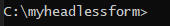
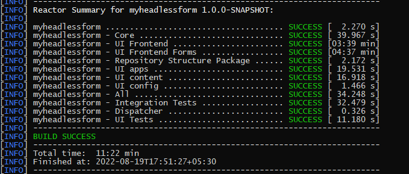
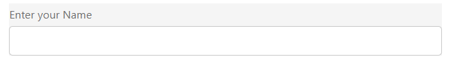
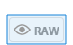
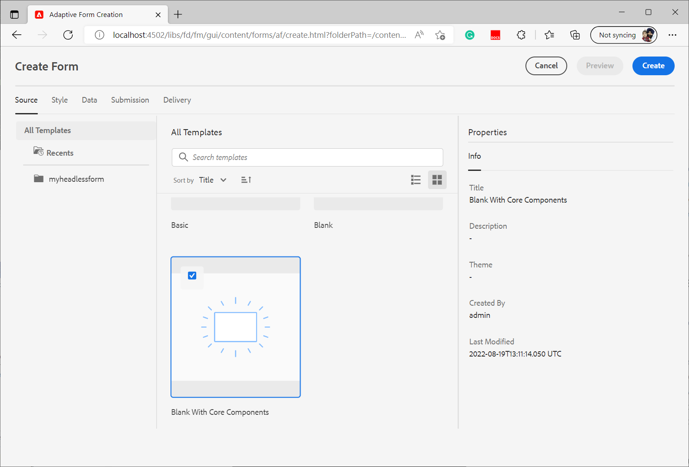

# Creare il primo modulo adattivo headless

Puoi utilizzare i moduli adattivi headless di Adobe Experience Manager per creare applicazioni Forms utilizzando l’interfaccia utente front-end, ad esempio React, e utilizzare Forms Web SDK per funzionalità quali la gestione dello stato, la convalida e le integrazioni con vari altri punti di contatto.

Un&#39;organizzazione, ad esempio, che sta cercando di digitalizzare il percorso di registrazione dei clienti. I loro sviluppatori sono esperti nell’utilizzo di Angular per creare soluzioni front-end. Cercano di creare un front-end personalizzato scaricando la convalida dei moduli e le firme elettroniche in soluzioni specializzate.

I moduli adattivi headless di Adobe Experience Manager offrono a tali organizzazioni la libertà di creare moduli utilizzando le competenze esistenti in lingue front-end e fornendo al contempo supporto per l’utilizzo di funzionalità back-end per creare un’esperienza di moduli di classe enterprise.

<!-- >>[!VIDEO](https://video.tv.adobe.com/v/341011/) -->

<!--   -->

## Prima di iniziare

* Configurare [ambiente di sviluppo](setup-development-environment.md) per creare e testare un modulo adattivo headless sul computer locale.
* Il seguente software deve essere installato sul computer di sviluppo locale:
   * [Java Development Kit 11](https://experience.adobe.com/#/downloads/content/software-distribution/en/general.html?1_group.propertyvalues.property=.%2Fjcr%3Acontent%2Fmetadata%2Fdc%3AsoftwareType&amp;1_group.propertyvalues.operation=equals&amp;1_group.propertyvalues.0_values=tipo di software%3Atooling&amp;fulltext=Oracle%7E+JDK%7E+11%7E&amp;orderby=%40jcr%3Acontent%2Fjcr%3AlastModified&amp;orderby.sort=desc&amp;layout=list&amp;p.offset=0&amp;p.limit=14)
   * [Ultima versione di Git](https://git-scm.com/downloads). Se hai poca esperienza con Git, consulta [Installazione di Git](https://git-scm.com/book/en/v2/Getting-Started-Installing-Git).
   * [Node.js 16.13.0 o versione successiva](https://nodejs.org/it/download/). Se hai poca esperienza con Node.js, consulta [Come installare Node.js](https://nodejs.dev/en/learn/how-to-install-nodejs).
   * [Maven 3.6 o versione successiva](https://maven.apache.org/download.cgi). Se hai poca esperienza con Maven, consulta [Installazione di Apache Maven](https://maven.apache.org/install.html).


## Utilizzare il progetto Archetipo per creare un modulo adattivo headless

Il progetto Archetipo è un modello basato su Maven. Crea un progetto minimo basato sulle best practice per iniziare a utilizzare i moduli adattivi headless. Include inoltre la funzionalità Headless per moduli adattivi per ambienti di sviluppo Forms as a Cloud Service e locali. È obbligatorio creare e distribuire il progetto basato su Archetipo 37 o versione successiva durante la fase beta. Dopo la versione beta, il progetto sarebbe necessario solo per le personalizzazioni.

Per creare ed eseguire il rendering del primo modulo adattivo headless, effettua le seguenti operazioni:

1. [Creare e distribuire un progetto basato su Archetipo AEM](#create-an-archetype-based-project)
1. [Implementare il progetto nell’SDK per AEM](#deploy-the-project-to-a-local-development-environment)
1. [Crea uno schema JSON per un modulo adattivo headless e caricalo nell’istanza SDK AEM](#create-add-json-representation-of-headless-adaptive-forms)
1. [Creare un modulo adattivo basato sul modello vuoto con componenti core](#create-adaptive-form-with-blank-with-core-components-template)


### 1. Creare e distribuire un progetto basato su Archetipo AEM {#create-an-archetype-based-project}

A seconda del sistema operativo, esegui il comando seguente per creare un progetto Experience Manager Forms as a Cloud Service. Utilizza la versione 37 o successiva di Archetipo. Vedi, [Documentazione di Archetipo](https://experienceleague.adobe.com/docs/experience-manager-core-components/using/developing/archetype/overview.html?lang=it) per trovare la versione più recente di Archetipo.

**Microsoft Windows**

1. Aprire il prompt dei comandi con privilegi amministrativi (eseguire il prompt dei comandi o la shell di base come amministratore)
1. Esegui il comando seguente:

   ```shell
     mvn -B org.apache.maven.plugins:maven-archetype-plugin:3.2.1:generate ^
     -D archetypeGroupId=com.adobe.aem ^
     -D archetypeArtifactId=aem-project-archetype ^
     -D archetypeVersion=37 ^
     -D appTitle=myheadlessform ^
     -D appId=myheadlessform ^
     -D groupId=com.myheadlessform ^
     -D includeFormsenrollment="y" ^
     -D includeFormsheadless="y" 
   ```

   * Imposta `appTitle` per definire il titolo e i gruppi di componenti.
   * Imposta `appId` per definire l’ID dell’artefatto Maven, i nomi delle cartelle di componenti, configurazione e contenuto e i nomi delle librerie client.
   * Imposta `groupId` per definire l’ID gruppo Maven e il pacchetto sorgente Java.
   * Utilizza il `includeFormsenrollment=y` opzione per includere configurazioni, temi, modelli, Componenti core e dipendenze specifiche di Forms necessari per creare Forms adattivo.
   * Utilizza il `includeFormsheadless=y` opzione per includere i componenti core Forms e le dipendenze necessarie per includere la funzionalità Forms adattivo headless. Quando si abilita questa opzione, sono inclusi i seguenti elementi:
      * Il **Vuoto con i Componenti core** modello con [Componenti core](https://experienceleague.adobe.com/docs/experience-manager-core-components/using/introduction.html?lang=it).
      * Un modulo di reazione front-end, `ui.frontend.react.forms.af`. Consente di eseguire il rendering di un modulo adattivo headless in un’app react.


**Apple macOS o Linux**:

1. Apri il terminale come utente root. Consente di eseguire comandi con privilegi amministrativi. Puoi anche utilizzare `sudo root` dopo l&#39;apertura della finestra del terminale per eseguire comandi con privilegi amministrativi.
1. Esegui il comando seguente:

   ```shell
     mvn -B org.apache.maven.plugins:maven-archetype-plugin:3.2.1:generate \
     -D archetypeGroupId=com.adobe.aem \
     -D archetypeArtifactId=aem-project-archetype \
     -D archetypeVersion=37 \
     -D appTitle=myheadlessform \
     -D appId=myheadlessform \
     -D groupId=com.myheadlessform \
     -D includeFormsenrollment="y" \
     -D includeFormsheadless="y"  
   ```

   * Imposta `appTitle` per definire il titolo e i gruppi di componenti.
   * Imposta `appId` per definire l’ID dell’artefatto Maven, i nomi di componente, configurazione, cartella dei contenuti e libreria client.
   * Imposta `groupId` per definire l’ID gruppo Maven e il pacchetto sorgente Java.
   * Utilizza il `includeFormsenrollment=y` opzione per includere configurazioni, temi, modelli, Componenti core e dipendenze specifiche di Forms necessari per creare Forms adattivo.
   * Utilizza il `includeFormsheadless=y` opzione per includere i componenti core Forms e le dipendenze necessarie per includere la funzionalità Forms adattivo headless. Quando si abilita questa opzione, sono inclusi i seguenti elementi:
      * Il **Vuoto con i Componenti core** modello con [Componenti core](https://experienceleague.adobe.com/docs/experience-manager-core-components/using/introduction.html?lang=it).
      * Un modulo di reazione front-end, `ui.frontend.react.forms.af`. Consente di eseguire il rendering di un modulo adattivo headless in un’app react.

Al completamento del comando, una cartella di progetto con il nome specificato in `appID` viene creato. Ad esempio, se utilizzi `appID` con valore `myheadlessform`, una cartella denominata `myheadlessform` viene creato. Contiene il progetto basato su Archetipo.


### 2. Distribuire il progetto nell’SDK dell’AEM {#deploy-the-project-to-a-local-development-environment}

Quando distribuisci il progetto all’istanza dell’SDK AEM, aggiunge la funzionalità Headless Adaptive Forms, **Vuoto con i Componenti core** e altre risorse incluse nel progetto nell’ambiente di sviluppo. <!-- Deploy the project to your local development environment to locally create Headless Adaptive Forms. or deploy directly to your Forms as a Cloud Service environment. !--> Per implementare nell’istanza dell’SDK per AEM:

1. Apri il prompt dei comandi. Se si utilizza Windows, aprire il prompt dei comandi con privilegi di amministratore (eseguire il prompt dei comandi o [Git bash shell](https://khushwantsehgal.wordpress.com/2022/06/29/check-if-git-bash-is-running-in-administrator-mode/)  come amministratore).

1. Passa alla directory del progetto creata nel passaggio precedente. Ad esempio `/myheadlessform`

   

1. Esegui il comando seguente:

   ```shell
   mvn -PautoInstallPackage clean install
   ```

   Attendi il messaggio &quot;BUILD SUCCESS&quot;.
   

   La risoluzione delle dipendenze e la distribuzione del progetto possono richiedere molto tempo. In caso di errore durante la distribuzione del progetto, vedi [risoluzione dei problemi](troubleshooting.md) articolo per le questioni comuni e la loro risoluzione.


<!-- *  To learn how to deploy code to AEM as a Cloud Service, see the video in [Deploying to AEM as a Cloud Service]https://experienceleague.adobe.com/docs/experience-manager-cloud-service/content/implementing/deploying/overview.html?lang=en#coding-against-the-right-aem-version) article : -->


### 3. Crea uno schema JSON per un modulo adattivo headless e caricalo nell’istanza SDK dell’AEM {#create-add-json-representation-of-headless-adaptive-forms}

Un Forms adattivo headless è rappresentato come file JSON. Puoi ottenere un modulo di esempio da [Storybook](https://opensource.adobe.com/aem-forms-af-runtime/storybook/?path=/story/reference-examples--contact) o utilizza il modulo di esempio include in Archetype Project all’indirizzo `[Archetype Project]\ui.content\src\main\content\jcr_root\content\dam\myheadlessform\af_model_sample.json`. Questo documento utilizza [introduzione](https://opensource.adobe.com/aem-forms-af-runtime/storybook/?path=/story/reference-examples--introduction) modulo di Storybook. Si tratta di un modulo a campo singolo che consente di iniziare rapidamente a utilizzare Forms adattivo headless. <!-- The [specifications](/help/assets/Headless-Adaptive-Form-Specification.pdf) document provides detailed information about various components, rules, and constraints for Headless Adaptive Forms -->

Per creare e caricare lo schema:

1. Creare un file di testo normale con estensione `.json`. Esempio: `myfirstform.json`. Puoi creare il file ovunque nel file system o nel progetto basato su Archetipo AEM all’indirizzo `\<project-name>\ui.content\src\main\content\jcr_root\content\dam\myheadlessform\<formname>.json`
1. Aggiungi il seguente contenuto JSON al tuo `.json` e salvarlo:

   ```JSON
   {
     "adaptiveform": "0.10.0",
     "items": [
       {
         "fieldType": "text-input",
         "label": {
           "value": "Enter your Name"
         },
         "name": "textInput"
       }
     ],
     "metadata": {
       "grammar": "json-formula-1.0.0",
       "version": "1.0.0"
     }
   }
   ```

   Aggiunge un singolo campo al modulo:

   

1. Accedi al tuo [istanza locale dell’SDK AEM](setup-development-environment.md#setup-author-instance)
1. Passa a Adobe Experience Manager > Forms > Forms e Documenti. Tocca Crea > Caricamento file.
1. Seleziona la `.json` creato nel passaggio 2 e caricato. Ora puoi creare il modulo adattivo headless. Se salvi il file .json nel progetto basato su Archetipo AEM in `\<project-name>\ui.content\src\main\content\jcr_root\content\dam\myheadlessform\<formname>.json`. È possibile utilizzare `mvn -PautoInstallPackage clean install` per implementare il progetto nell’SDK per AEM e `<formname>.json` insieme ad esso.

In caso di errore durante il caricamento di `.json`, assicurano che [Il progetto dell’archetipo AEM è stato distribuito correttamente](#deploy-the-project-to-a-local-development-environment).

<!-- 1. Open the [contact form](https://opensource.adobe.com/aem-forms-af-runtime/storybook/?path=/story/reference-examples--contact) and tap the [](faq.md#storybook-example) icon on bottom-right side of the Storybook page to view the source code of the headless . 

You can use [Adaptive Forms builder extension for Visual Studio Code](/help/setup-development-environment.md#microsot-visual-studio-code-extension-for-headless-adaptive-forms) to build a JSON schema of your Headless Adaptive Forms. 

You can see [Storybook](https://opensource.adobe.com/aem-forms-af-runtime/storybook/?path=/story/reference-examples--introduction) for sample JSON schemas and list of components, attributes, and properties. You can also see the [specifications document](/help/assets/Headless-Adaptive-Form-Specification.pdf) for detailed information on all the components, constraints, and methods available to define Headless Adaptive Forms.

File extension of a JSON schema of Headless Adaptive Forms is .json. For example, formname.json. Create or add the file to your AEM Archetype based project. For example, `\myheadlessform\ui.content\src\main\content\jcr_root\content\dam\myheadlessform\home-loan.json` -> 

### 3. Deploy the project to a local development environment {#deploy-the-project-to-a-local-development-environment}

You can deploy the project to local development environment. It adds Headless Adaptive Forms functionality, the **Blank with core components** template, JSON schema of form, and other resources included in the project to your development environment. <!-- Deploy the project to your local development environment to locally create Headless Adaptive Forms. or deploy directly to your Forms as a Cloud Service environment. To deploy to your local development environment, use the following command: 

    `mvn -PautoInstallPackage clean install`

If you are on Windows, run the above with Administrative privileges (Run command prompt or [bash shell as an administrator](https://khushwantsehgal.wordpress.com/2022/06/29/check-if-git-bash-is-running-in-administrator-mode/)). For the complete list of commands, see [Building and Installing](https://experienceleague.adobe.com/docs/experience-manager-core-components/using/developing/archetype/using.html?lang=en#building-and-installing).
    
<!-- *  To learn how to deploy code to AEM as a Cloud Service, see the video in [Deploying to AEM as a Cloud Service]https://experienceleague.adobe.com/docs/experience-manager-cloud-service/content/implementing/deploying/overview.html?lang=en#coding-against-the-right-aem-version) article : -->

### 4. Creare un modulo adattivo basato sul modello vuoto con componenti core {#create-adaptive-form-with-blank-with-core-components-template}

1. Accedi al tuo [Istanza dell’SDK AEM](Http://localhost:4502/).

1. Passa a Adobe Experience Manager > Forms > Forms e Documenti.

1. Tocca Crea e seleziona Modulo adattivo. Seleziona la **Vuoto con i Componenti core** e tocca Crea.

   

1. Specificare i valori per i campi delle proprietà seguenti. I campi Titolo e Nome sono obbligatori:

   * **Titolo**: specifica il nome visualizzato del modulo. Il titolo consente di identificare il modulo nell’interfaccia utente di Experience Manager Forms.
   * **Nome**: specifica il nome del modulo. Nell’archivio viene creato un nodo con il nome specificato. Quando si inizia a digitare un titolo, il valore del campo nome viene generato automaticamente. Puoi modificare il valore suggerito. Il campo nome può contenere solo caratteri alfanumerici, trattini e caratteri di sottolineatura. Tutti gli input non validi vengono sostituiti da un trattino.

1. Tocca Crea. Viene creato un modulo adattivo.

Se non vede il **Vuoto con i Componenti core** , assicurati che il [Il progetto dell’archetipo AEM è stato distribuito correttamente](#deploy-the-project-to-a-local-development-environment).

### 5. Configurare il modulo adattivo per utilizzare lo schema JSON {#configure-adaptive-form-to-use-the-JSON-representation}

Il modulo adattivo creato nel passaggio precedente è vuoto. Configura il modulo adattivo per utilizzare lo schema JSON:

1. Accedi al tuo [Istanza dell’SDK AEM](Http://localhost:4502/).

1. Passa a Adobe Experience Manager > Forms > Forms e Documenti. Seleziona il modulo adattivo creato nel passaggio precedente e tocca Modifica. Il modulo adattivo si apre nell’editor.

1. Tocca il componente Contenitore Forms adattivo e Tocca Proprietà. Visualizza l’elenco delle proprietà nella barra laterale.

1. In Esplora proprietà, espandi il pannello a soffietto BASE e specifica il percorso dello schema JSON caricato in un passaggio precedente per l’opzione Percorso documento di Forms Runtime. Il componente Contenitore visualizza una rappresentazione del modulo.

1. In Esplora proprietà, espandi il pannello a soffietto INVIO e imposta un’azione di invio per il modulo adattivo. Il modulo è pronto per essere utilizzato in un’app React.

1. Per eseguire il rendering del modulo, in hosting sul computer di sviluppo locale:

   1. Apri `[Archetype project]\ui.frontend.react.forms.af\.env` e impostare il percorso del modulo. Ad esempio, /content/forms/af/contact

   1. Apri il prompt dei comandi e passa al progetto ui.frontend.react.forms.af ed esegui il comando seguente:

      `npm run start`

   1. Dopo il completamento, apri localhost:3000 nella finestra del browser per visualizzare il modulo adattivo headless renderizzato.
   1. Per testare la funzionalità di invio, accedi al tuo server AEM Forms e utilizza **Visualizzare l’anteprima del modulo in HTML** per aprire il modulo in modalità anteprima.

Il [Storybook](https://opensource.adobe.com/aem-forms-af-runtime/storybook/) fornisce un elenco di componenti e regole che possono essere impostati su vari Forms headless adattivi, insieme ad alcuni esempi di schema JSON di Forms headless adattivi. È inoltre possibile visualizzare [specifiche](/help/assets/Headless-Adaptive-Form-Specification.pdf) Questo documento contiene informazioni su varie regole e proprietà relative a Headless Adaptive Forms.
