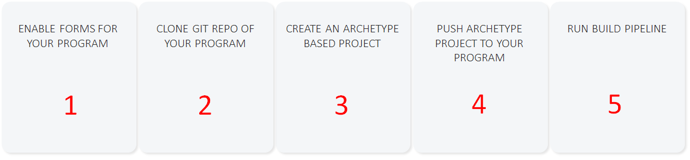
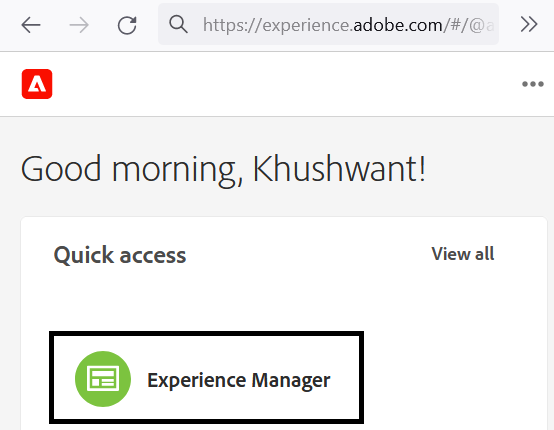
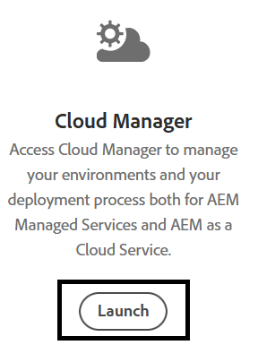
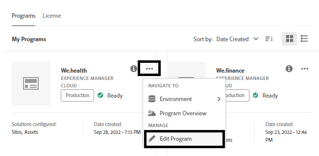
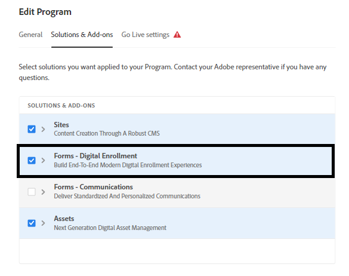
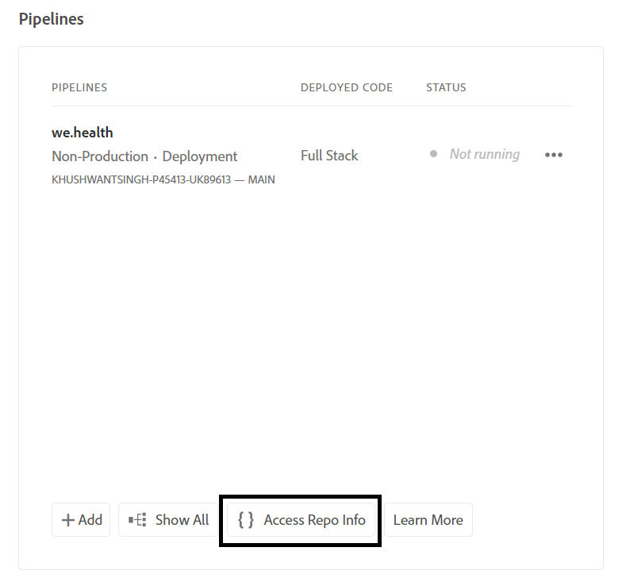
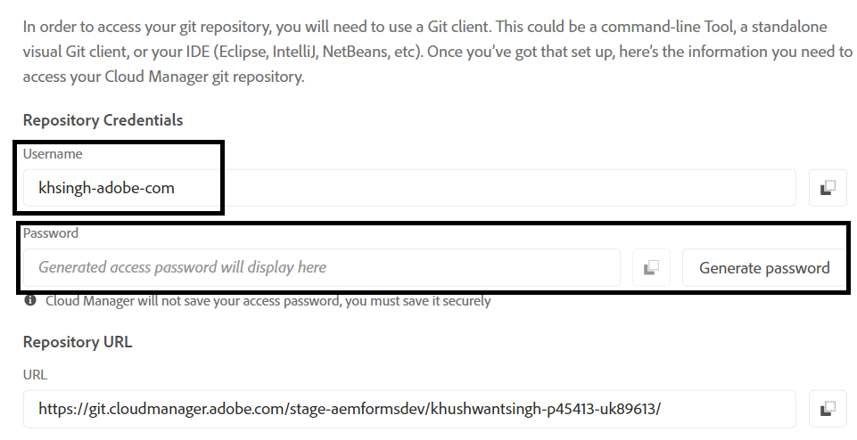
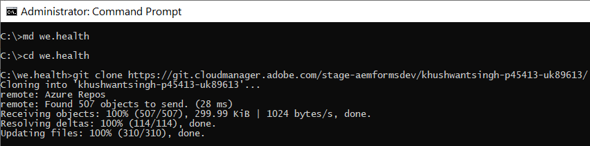
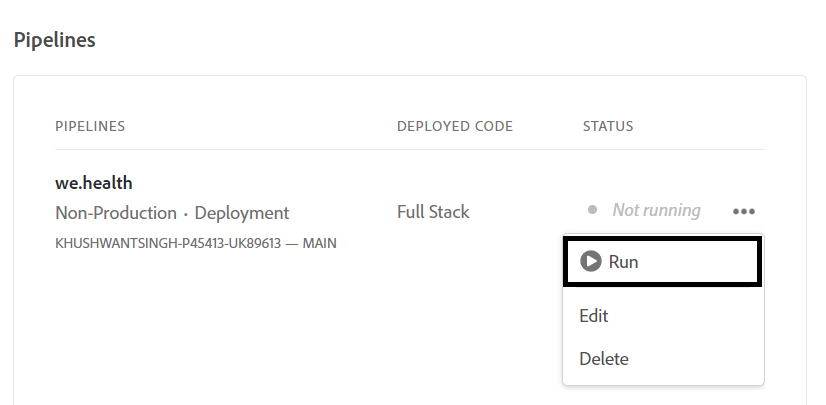

# Configurare l’ambiente di sviluppo per i moduli adattivi headless su Cloud Service

<span class="preview"> Questo è un **LAVORO IN CORSO** articolo.</span>


Sei pronto a creare e testare moduli adattivi headless sul Cloud Service? Abilita Forms per il tuo programma di Cloud Service e vai avanti.

## Prima di iniziare

* Installa [Versione più recente di Git](https://git-scm.com/downloads) sul computer locale. Se hai poca esperienza con Git, consulta [Installazione di Git](https://git-scm.com/book/en/v2/Getting-Started-Installing-Git). L’archivio Git viene utilizzato per inviare all’ambiente di sviluppo del Cloud Service i moduli e il codice personalizzato sviluppati nell’ambiente di sviluppo locale.

* Installa [Node.js 16.13.0 o versione successiva](https://nodejs.org/it/download/) sul computer locale. Se hai poca esperienza con Node.js, consulta [Come installare Node.js](https://nodejs.dev/en/learn/how-to-install-nodejs).

* Creazione di un programma AEM as a Cloud Service: seguire i passaggi 1-7 della [crea programma](https://experienceleague.adobe.com/docs/experience-manager-cloud-service/content/onboarding/demo-add-on/create-program.html?#create-program) per creare un programma per la tua organizzazione.

* Abilita [Canale prerelease per il programma di Cloud Service](https://experienceleague.adobe.com/docs/experience-manager-cloud-service/content/release-notes/prerelease.html?cloud-environments).

## Imposta flusso di lavoro

Per abilitare i moduli adattivi headless nella sandbox as a Cloud Service di Forms, abilita `Forms - Digital enrolment` soluzione per il programma AEM Cloud Service, crea un progetto basato su Archetipo 37 o versione successiva sul computer locale e invialo all’ambiente Forms as a Cloud Service. Il processo completo è:



### 1. Abilitare Forms per il programma

<table style="table-layout:auto">
<tr>
  <td>
  1. Accedere a <a href="https://experience.adobe.com/" > https://experience.adobe.com/ </a>  e seleziona la <b> Experience Manager </b> opzione.
  </td>
  <td>
    <a href="https://experienceleague.adobe.com/docs/experience-manager-cloud-service/content/onboarding/demo-add-on/create-program.html?#create-program">
      
    </a>
    <br>
  </td>
</tr>
<tr>
  <td>
  2. Per il <b> Cloud Manager </b> , fare clic su <b> Avvia. </b> Viene visualizzato un elenco di programmi per l'organizzazione.
  </td>
  <td>
    <a href="https://experienceleague.adobe.com/docs/experience-manager-cloud-service/content/onboarding/demo-add-on/create-program.html?#create-program">
      
    </a>
    <br>
  </td>
</tr>
<tr>
  <td>
    3. Per il programma, tocca l’icona ... e seleziona la <b> Modifica programma </b> opzione. Viene visualizzata una finestra di dialogo. 
  </td>
  <td>
    <a href="https://experienceleague.adobe.com/docs/experience-manager-cloud-service/content/onboarding/demo-add-on/create-program.html?#create-program">
      
    </a>
    <br>
  </td>
</tr>
<tr>
  <td>
    4. Nella finestra di dialogo Modifica programma, vai al <b> Scheda Soluzioni e componenti aggiuntivi </b>, seleziona la <b> Forms - Registrazione digitale </b> e tocca <b> aggiorna </b>. 
  </td>
  <td>
    <a href="https://experienceleague.adobe.com/docs/experience-manager-cloud-service/content/onboarding/demo-add-on/create-program.html?#create-program">
      
    </a>
    <br>
  </td>
</tr>
</table>

### 2. Clone Git repository del programma nel computer locale

Ogni programma AEM as a Cloud Service ha un archivio Git. Consente di caricare codice personalizzato e risorse dal computer locale all’ambiente del Cloud Service. Durante la configurazione, utilizziamo l’archivio Git per portare dal computer locale al programma di Cloud Service il codice, i modelli e altre informazioni relative ai moduli adattivi headless. La clonazione dell’archivio Git di Cloud Service nel computer locale è il primo passaggio per portare codice personalizzato e contenuto dal computer locale al Cloud Service.

>[!INFO]
>
> È sempre possibile eseguire il commit in un archivio Git senza clonarlo. Ma ha le sue peculiarità. In questo documento viene quindi utilizzato l&#39;approccio basato sulla clonazione.


Per clonare l’archivio:

<table style="table-layout:fixed">
<tr>
  <td>
  1. Nella casella delle pipeline del programma, tocca <b> Accedi a dati archivio. </b> Viene visualizzata una finestra di dialogo con le informazioni dell’archivio 
  </td>
  <td>
    <a href="https://experienceleague.adobe.com/docs/experience-manager-cloud-service/content/onboarding/demo-add-on/create-program.html?#create-program">
      
    </a>
    <br>
  </td>
</tr>
<tr>
  <td>
  2. Toccare <b> Genera password </b> e copia <b> URL archivio. </b> 
  </td>
  <td>
      
    <br>
  </td>
</tr>
<tr>
  <td>
    3. Nel computer locale aprire il prompt dei comandi, creare una cartella, eseguire il comando seguente e fornire le credenziali del repository, richiesto:
    </br>
    <code> git clone [Repository URL] </code> </br></br>
    Ad esempio: </br> 
    <code> git clone https://git.cloudmanager.adobe.com/stage-aemformsdev/khushwantsingh-p45413-uk89613/ </code>

</br> Quando ti viene chiesto, ottieni il <b> Nome utente</b> e <b>Password</b> dal <b>Informazioni archivio</b> schermo.
</td>
  <td>
     
  </td>
</tr>
</table>


### 3. Creare un progetto basato su Archetipo AEM

Il progetto Archetipo è un modello basato su Maven. Crea un progetto minimo basato sulle best practice per iniziare a utilizzare i moduli adattivi headless. Include inoltre la funzionalità core Moduli adattivi headless per Forms as a Cloud Service. È obbligatorio creare e distribuire il progetto basato su Archetipo 37 o versione successiva.
®®® A seconda del sistema operativo, esegui il comando maven per creare un progetto Experience Manager Forms as a Cloud Service. Utilizza la versione 37 o successiva di Archetipo. Consulta [Documentazione di Archetipo](https://experienceleague.adobe.com/docs/experience-manager-core-components/using/developing/archetype/overview.html?lang=it) per trovare la versione più recente di Archetipo.

+++ Microsoft® Windows

1. Aprire il prompt dei comandi con privilegi amministrativi (eseguire il prompt dei comandi o la shell di base come amministratore).
1. Esegui il comando seguente:

   ```shell
     mvn -B org.apache.maven.plugins:maven-archetype-plugin:3.2.1:generate ^
     -D archetypeGroupId=com.adobe.aem ^
     -D archetypeArtifactId=aem-project-archetype ^
     -D archetypeVersion=37 ^
     -D appTitle=myheadlessform ^
     -D appId=myheadlessform ^
     -D groupId=com.myheadlessform ^
     -D includeFormsenrollment="y" ^
     -D includeFormsheadless="y" 
   ```

™™™ * Imposta `appTitle` per definire il titolo e i gruppi di componenti.
* Imposta `appId` per definire l’ID dell’artefatto Maven, i nomi delle cartelle di componenti, configurazione e contenuto e i nomi delle librerie client.
* Imposta `groupId` per definire l’ID gruppo Maven e il pacchetto sorgente Java™.
* Utilizza il `includeFormsenrollment=y` opzione per includere configurazioni, temi, modelli, Componenti core e dipendenze specifiche di Forms necessari per creare Forms adattivo.
* Utilizza il `includeFormsheadless=y` opzione per includere i componenti core Forms e le dipendenze necessarie per includere la funzionalità dei moduli adattivi headless. Quando si abilita questa opzione, sono inclusi i seguenti elementi:\
* La **Vuoto con i Componenti core** modello con [Componenti core](https://experienceleague.adobe.com/docs/experience-manager-core-components/using/introduction.html?lang=it).
* Un modulo di reazione front-end, `ui.frontend.react.forms.af`. Ti aiuta a eseguire il rendering di un modulo adattivo headless in un’app react.

+++®®


+++ Apple macOS o Linux®

1. Apri il terminale come utente root. Consente di eseguire comandi con privilegi amministrativi. Puoi anche utilizzare `sudo root` dopo l&#39;apertura della finestra del terminale per eseguire comandi con privilegi amministrativi.
1. Esegui il comando seguente:

   ```shell
     mvn -B org.apache.maven.plugins:maven-archetype-plugin:3.2.1:generate \
     -D archetypeGroupId=com.adobe.aem \
     -D archetypeArtifactId=aem-project-archetype \
     -D archetypeVersion=37 \
     -D appTitle=myheadlessform \
     -D appId=myheadlessform \
     -D groupId=com.myheadlessform \
     -D includeFormsenrollment="y" \
     -D includeFormsheadless="y"  
   ```

™™™ * Imposta `appTitle` per definire il titolo e i gruppi di componenti.
* Imposta `appId` per definire l’ID dell’artefatto Maven, i nomi di componente, configurazione, cartella dei contenuti e libreria client.
* Imposta `groupId` per definire l’ID gruppo Maven e il pacchetto sorgente Java™.
* Utilizza il `includeFormsenrollment=y` opzione per includere configurazioni, temi, modelli, Componenti core e dipendenze specifiche di Forms necessari per creare Forms adattivo.
* Utilizza il `includeFormsheadless=y` opzione per includere i componenti core Forms e le dipendenze necessarie per includere la funzionalità dei moduli adattivi headless. Quando si abilita questa opzione, sono inclusi i seguenti elementi:\
* La **Vuoto con i Componenti core** modello con [Componenti core](https://experienceleague.adobe.com/docs/experience-manager-core-components/using/introduction.html?lang=it).
* Un modulo di reazione front-end, `ui.frontend.react.forms.af`. Ti aiuta a eseguire il rendering di un modulo adattivo headless in un’app react.

+++

Al completamento del comando, una cartella di progetto con il nome specificato in `appID` viene creato. Ad esempio, se utilizzi `appID` con valore `myheadlessform`, una cartella denominata `myheadlessform` viene creato. Contiene il progetto basato su Archetipo.

### 4. Inviare il progetto basato su Archetipo AEM all’ambiente del Cloud Service

1. Sostituisci il contenuto dell’archivio Git con il contenuto su del progetto basato su Archtype.

   >[!VIDEO](https://video.tv.adobe.com/v/3409809/)

1. Apri il prompt dei comandi, accedi alla cartella dell’archivio Git ed esegui i comandi seguenti nell’ordine elencato per caricare nell’ambiente di Cloud Service il contenuto sostituito. È inoltre possibile utilizzare un editor visivo invece di utilizzare i comandi seguenti per inviare contenuti all’archivio del Cloud Service.

   ```
      git add .
      git commit
      git push origin
   ```

### 5. Esegui la pipeline di build per il programma


<table style="table-layout:auto">
<tr>
  <td>
  1. Accedere a <a href="https://experience.adobe.com/" > https://experience.adobe.com/ </a>  e seleziona la <b> Experience Manager </b> opzione.
  </td>
  <td>
    <a href="https://experienceleague.adobe.com/docs/experience-manager-cloud-service/content/onboarding/demo-add-on/create-program.html?#create-program">
      
    </a>
    <br>
  </td>
</tr>
<tr>
  <td>
  2. Per il <b> Cloud Manager </b> , fare clic su <b> Avvia. </b> Viene visualizzato un elenco di programmi per l'organizzazione. Apri il programma. 
  </td>
  <td>
    <a href="https://experienceleague.adobe.com/docs/experience-manager-cloud-service/content/onboarding/demo-add-on/create-program.html?#create-program">
      
    </a>
    <br>
  </td>
</tr>
<tr>
  <td>
    3. Per la pipeline, tocca l’icona ... e seleziona la <b> Esegui </b> opzione. Se richiesto, tocca <b> Esegui </b> e attendi pipeline <b> Stato </b>  per passare a <b> Completato </b>.  
  </td>
  <td>
    <a href="https://experienceleague.adobe.com/docs/experience-manager-cloud-service/content/onboarding/demo-add-on/create-program.html?#create-program">
      
    </a>
    <br>
  </td>
</tr>
</table>

Ora l’ambiente è pronto per l’utilizzo di moduli adattivi headless. Ora puoi caricare la definizione JSON di un modulo nell’ambiente di Cloud Service, creare un modulo adattivo headless basato su di esso e utilizzare [getForm](https://opensource.adobe.com/aem-forms-af-runtime/api/#tag/Get-Form-Definition/operation/getForm) e altre API rest per utilizzare il modulo adattivo headless nell’applicazione o nel servizio.
