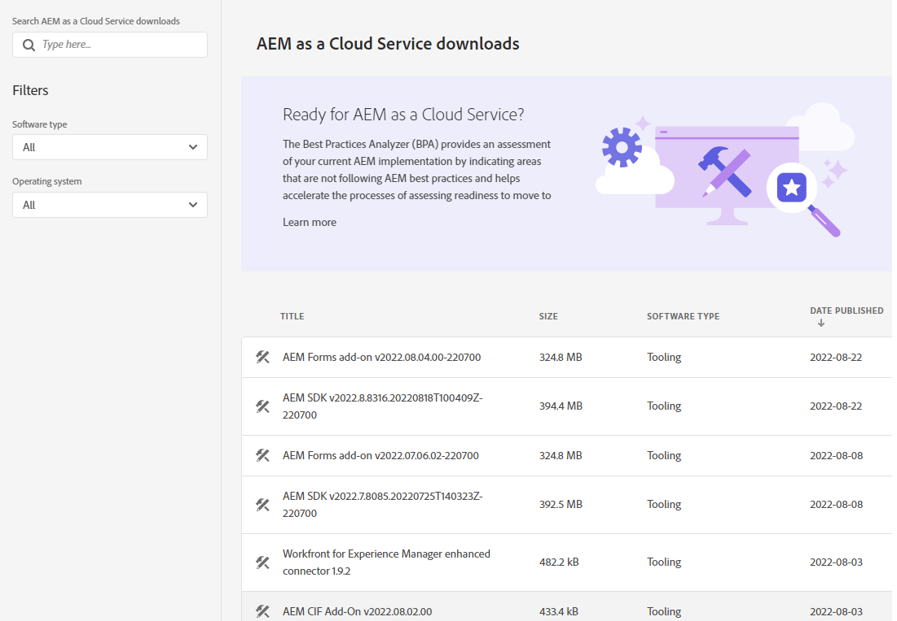
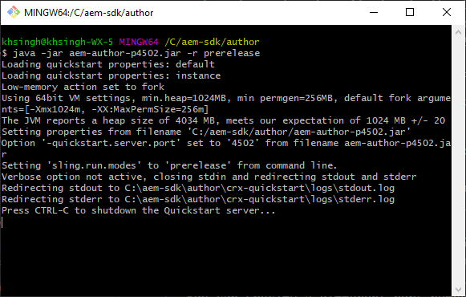

# Configurare un ambiente di sviluppo locale {#headless-adaptive-forms-setup-development-environment}

Puoi configurare un ambiente di sviluppo locale per creare e testare moduli adattivi headless sul computer locale. L’ambiente di sviluppo è costituito dall’SDK per AEM e dall’Archivio delle funzioni di AEM Forms installati sull’SDK per AEM.
<!--
 After a Headless adaptive form or related assets are ready on the local development environment, you can deploy the Headless adaptive form application to your publishing environment. -- >

You require knowledge to build application using react, Git, and Maven to use Headless adaptive forms.

<!-- 

### Download the latest version of AEM as a Cloud Service SDK or Forms feature archive (AEM Forms add-on) from Software Distribution {#software-distribution}

To download the supported version of Adobe Experience Manager as a Cloud Service SDK or Forms feature archive (AEM Forms add-on):

1. Log in to [Software Distribution](https://experience.adobe.com/#/downloads) portal with your Adobe ID.

    >[!NOTE]
    >
    > Your Adobe Organization must be provisioned for AEM as a Cloud Service to download the AEM as a Cloud Service SDK.

1. Navigate to the **[!UICONTROL AEM as a Cloud Service]** tab.
1. Sort by published date in descending order.
1. Click on the latest Adobe Experience Manager as a Cloud Service SDK or Forms feature archive (AEM Forms add-on).
1. Review and accept the EULA. Tap the **[!UICONTROL Download]** button. -->

## Requisiti di sistema {#headless-adaptive-forms-system-requirements}

Per installare l’SDK per AEM, il computer locale deve soddisfare i seguenti requisiti minimi:

* [Java Development Kit 11](https://experience.adobe.com/#/downloads/content/software-distribution/en/general.html?1_group.propertyvalues.property=.%2Fjcr%3Acontent%2Fmetadata%2Fdc%3AsoftwareType&amp;1_group.propertyvalues.operation=equals&amp;1_group.propertyvalues.0_values=tipo di software%3Atooling&amp;fulltext=Oracle%7E+JDK%7E+11%7E&amp;orderby=%40jcr%3Acontent%2Fjcr%3AlastModified&amp;orderby.sort=desc&amp;layout=list&amp;p.offset=0&amp;p.limit=14)
* [Ultima versione di Git](https://git-scm.com/downloads). Se hai poca esperienza con Git, consulta [Installazione di Git](https://git-scm.com/book/en/v2/Getting-Started-Installing-Git).
* [Node.js 16.13.0 o versione successiva](https://nodejs.org/it/download/). Se hai poca esperienza con Node.js, consulta [Come installare Node.js](https://nodejs.dev/en/learn/how-to-install-nodejs).
* [Maven 3.6 o versione successiva](https://maven.apache.org/download.cgi). Se hai poca esperienza con Maven, consulta [Installazione di Apache Maven](https://maven.apache.org/install.html).

## Configurare l’ambiente di sviluppo {#headless-adaptive-forms-procedure-to-setup-development-environment}

Per creare un nuovo ambiente di sviluppo locale e utilizzarlo per sviluppare e testare moduli adattivi headless:

1. [Configurare l’SDK per AEM as a Cloud Service](#setup-author-instance).
1. [Aggiungere l’archivio AEM Forms (componente aggiuntivo Cloud Service AEM Forms) all’SDK dell’AEM](#add-forms-archive).

<!--

1. (Optional) [Add Forms-specific users to your local Author instance](#configure-users-and-permissions).
1. (Optional) Install [Adaptive forms builder extension for Microsoft Visual Studio Code](#microsoft-visual-studio-code-extension-for-headless-adaptive-forms). 

-->

### 1. Configurare l’SDK as a Cloud Service per l’AEM {#setup-author-instance}

L’SDK per AEM as a Cloud Service (AEM SDK) offre agli sviluppatori un’esperienza locale per creare e testare moduli adattivi headless. Puoi utilizzare l’SDK per AEM as a Cloud Service sia per creare che per visualizzare in anteprima i moduli adattivi headless, in modo da eseguire localmente la maggior parte delle convalide relative allo sviluppo. Per impostare un&#39;istanza di authoring locale:

1. [Scarica](https://experience.adobe.com/#/downloads/content/software-distribution/it/aemcloud.html) più recente [!DNL Adobe Experience Manager] SDK as a Cloud Service. Utilizza la colonna Data di pubblicazione per ordinare e individuare facilmente l’SDK più recente.
È in formato .zip. La versione supportata è aem-sdk-2022.7.8085.20220725T140323Z-220700.zip e successive.

   


1. Estrai il file .zip scaricato in una directory sul computer locale.
1. Crea una directory sul computer locale da usare come percorso di installazione per l’istanza di authoring. Esempio: `~/aem-sdk/author`.
1. Copia il file .jar dai file SDK estratti nel percorso di installazione e rinomina il file in `aem-author-p4502.jar`. Il `p4502` stringa nel nome file specifica il numero di porta da utilizzare. È inoltre possibile specificare un numero di porta diverso.

   >[!NOTE]
   >
   > Non fare doppio clic sul file .jar per avviarlo. Si ottiene un [errore](https://experienceleague.adobe.com/docs/experience-manager-learn/cloud-service/local-development-environment-set-up/aem-runtime.html?lang=en#troubleshooting-double-click).

1. Apri il prompt dei comandi:
   * In Windows, utilizza **Esegui come amministratore** per aprire il prompt dei comandi in modalità avanzata.
   * Su Linux, accertati di aprire la finestra del terminale come utente root.

1. Passa alla posizione di installazione contenente il file .jar copiato ed esegui il comando seguente:

   `java -jar aem-author-p4502.jar -r prerelease`

   

   * Il `-r prerelease` switch abilita le funzioni disponibili solo nei programmi prerelease e limited release.
   * È possibile utilizzare `admin` come nome utente e password per lo sviluppo locale per ridurre il carico cognitivo.

   Dopo l’avvio dell’AEM, la pagina di accesso si apre nel browser web. Puoi anche aprire la pagina di accesso per l’istanza dell’SDK AEM all’indirizzo `http://localhost:<port>` nel browser. Ad esempio: [http://localhost:4502](Http://localhost:4502).

1. Accedi all’istanza di authoring. Tocca il  , toccare Informazioni su Adobe Experience Manager e assicurarsi che il numero di versione includa il suffisso PRERELEASE.

   Aiuto di 

Se non viene visualizzato il suffisso PRERELEASE, arrestare il server, eliminare `[AEM SDK installation]/crx-quickstart folder`, e riavviare il file .jar dell’SDK dell’AEM con `-r prerelease` switch. Per ulteriori opzioni, consulta [Risoluzione dei problemi](/help/troubleshooting.md).

### 2. Aggiungere l’archivio di AEM Forms (componente aggiuntivo per il Cloud Service AEM Forms) all’SDK dell’AEM {#add-forms-archive}

L’archivio delle funzioni as a Cloud Service di AEM Forms (componente aggiuntivo AEM Forms Cloud Service) fornisce gli strumenti necessari per creare moduli adattivi headless in un ambiente di sviluppo locale. Per installare l&#39;archivio delle funzionalità:

1. Scarica ed estrai la versione più recente [!DNL AEM Forms] archivio delle funzioni (componente aggiuntivo AEM Forms) da [Distribuzione di software](https://experience.adobe.com/#/downloads/content/software-distribution/en/aemcloud.html?fulltext=AEM*+Forms*+add*+on*&amp;orderby=%40jcr%3Acontent%2Fjcr%3AlastModified&amp;orderby.sort=desc&amp;layout=list&amp;p.offset=0&amp;p.limit=20). Utilizza la colonna Data di pubblicazione per ordinare e individuare facilmente l’SDK più recente. La versione supportata è aem-forms-addon-2022.07.06.02-220600 e versioni successive.

1. Passa alla directory crx-quickstart/install. Se la cartella non esiste, creala.
1. Arresta l’istanza dell’SDK per AEM. Per arrestare l’AEM, puoi chiudere la finestra del prompt dei comandi che esegue l’istanza dell’SDK per AEM.
1. Copia il [!DNL AEM Forms] archivio di funzioni del componente aggiuntivo da file, `aem-forms-addon-<version>.far`, estratto nel passaggio 1 nella cartella di installazione.
1. Utilizza il seguente comando per riavviare l’istanza dell’SDK per AEM:

   `java -jar aem-author-p4502.jar -r prerelease`

<!-- 

### 3. (Optional) Configure users and permissions {#configure-users-and-permissions}

Create seperate user accounts for Form Developer, Form Practitioner, and end users. These account help you test Headless adaptive forms for various types of users. To create a user account and add roles to the account:

1. Login to your AEM SDK instance.
1. Go to Tools > Security > Users and tap Create. The Create New User wizard opens.
1. In the details tab, specify an ID and Password. All other fields are optional. It is recommended to provide name and an email address.
1. In the Groups tab, search and select user-groups for a user depending on their role. The table below lists all types of users and pre-defined groups for each type of forms users based on their role:
  
    | User Type | AEM Group |
    |---|---|
    | Form developer | [!DNL forms-users] (AEM Forms Users), [!DNL template-authors], [!DNL workflow-users], [!DNL workflow-editors], and [!DNL fdm-authors]  |
    | Customer Experience Lead or UX Designer| [!DNL forms-users], [!DNL template-authors]|
    | AEM administrator | [!DNL aem-administrators], [!DNL fd-administrators] |
    | End user| When a user must log in to view and submit an Adaptive Form, add such users to [!DNL forms-users] group. </br> When no user authentication is required to access Adaptive Forms, do not assign any group to such users.|

<!-- ### 4. (Optional) Install Visual Studio Code extension for Headless adaptive forms {#microsoft-visual-studio-code-extension-for-headless-adaptive-forms}

You can use any IDE for developing Headless adaptive forms. Adobe provides an extension for Microsoft&reg;reg; Visual Studio Code to make it easier for you to navigate structure and develop Headless adaptive forms. The extension adds adaptive forms related IntelliSense capabilities and helps auto-complete Headless adaptive forms JSON syntax. It also adds a panel, titled Forms Tree, to help navigate structure of Headless adaptive form. To use the extension: 

1. Ensure [Microsoft Visual Studio Code 1.62.0 or later](https://code.visualstudio.com/docs/supporting/FAQ#_how-do-i-find-the-version) is installed. If you have an older version or no version installed, download the latest version from [Microsoft Website](https://code.visualstudio.com/docs/setup/setup-overview)
   >[!NOTE]
   >
   >
   > To use Visual Studio from command line on macOS, see [Launching from the command line](https://code.visualstudio.com/docs/setup/mac#_launching-from-the-command-line).

1. Download the [Adaptive forms builder extension](/help/assets/adaptive-form-builder-0.12.0.vsix).

1. Navigate the directory containing the *adaptive-form-builder-[version].vsix* file.

1. Run the following command or see [Install from a VSIX](https://code.visualstudio.com/docs/editor/extension-marketplace#_install-from-a-vsix) article for detailed instructions to install a Visual Studio Code extension from a VSIX file:

    `code -–install-extension adaptive-form-builder-[version].vsix`

    </br> Replace the [version] with actual version of the extension. For example, `code -–install-extension adaptive-form-builder-0.12.0.vsix`

    </br> 

    

<!-- ## Create and setup a react app

Adaptive forms renderer component is a react based component. It requires a react app to run and render a Headless adaptive form. To create and setup react app:

1. Open terminal in Visual Studio code and run the following command to create a react app and installs all related dependencies:

    ```shell
    npx create-react-app [react-app-name] --scripts-version 4.0.3 --template typescript
    ```

    Where [react-app-name] represents name of the project, script version is 4.0.3, and template of type typescript. For example, the following command creates a react app named *headless-forms-demo*.

    ```shell
    npx create-react-app headless-forms-demo --scripts-version 4.0.3 --template typescript
    ```

    It may take some time to create the react app and install all the dependencies. The command creates an empty react app with latest version of react and react-dom dependencies. It does not have any artifacts related to adaptive forms renderer component.

1. Adaptive forms renderer component is based on react spectrum and requires react 16.0.0 and react-dom 16.0.0. To install react 16.0.0 and related dependencies:
    1. Open the Visual Studio code terminal Window or command prompt.
    1. Navigate to the directory of react project.  
    1. Run the following command:

        ```shell
        npm install --save react@16.0.0 react-dom@16.14.0 -force
        ```

1. Run the following command to install adaptive forms renderer component related dependencies:

    ```shell
    npm i --save @aemforms/forms-super-component @aemforms/forms-react-core-components @aemforms/forms-super-component @adobe/react-spectrum @react/react-spectrum
    ```

<!-- 1. Install dependencies for adaptive forms renderer component. Packages for these dependencies are available in Adobe Artifactory. To authenticate with Adobe Artifactory and install dependencies for adaptive forms renderer component:

    1. Create environment variables ARTIFACTORY_USER and ARTIFACTORY_API_TOKEN. The ARTIFACTORY_USER stores Adobe LDAP username and ARTIFACTORY_API_TOKEN stores your [Adobe Artifactory token](https://wiki.corp.adobe.com/display/Artifactory/API+Keys)

    1. Run the following command to set NPM_TOKEN and NPM_EMAIL tokens:

        ```shell

        auth=$(curl -s -u${ARTIFACTORY_USER}:${ARTIFACTORY_API_TOKEN} https://artifactory.corp.adobe.com/artifactory/api/npm/auth)
        export NPM_TOKEN=$(echo "${auth}" | grep "_auth" | awk -F " " '{ print $3 }')
        export NPM_EMAIL=$(echo "${auth}" | grep "email" | awk -F " " '{ print $3 }')
        ```

        These tokens are required to communicated with Adobe Artifactory.

    1. Create a .npmrc file in the react project.

        

    1. Add the following code to the file:

        ```shell
        @aemforms:registry=https://artifactory.corp.adobe.com/artifactory/api/npm/npm-aem-release/
        @react:registry=https://artifactory.corp.adobe.com/artifactory/api/npm/npm-react-release/
        @quarry:registry=https://artifactory.corp.adobe.com/artifactory/api/npm/npm-adobe-release-local/
        //artifactory.corp.adobe.com/artifactory/api/npm/npm-adobe-release-loca/:_auth=${NPM_TOKEN}
        //artifactory.corp.adobe.com/artifactory/api/npm/npm-aem-release/:_auth=${NPM_TOKEN}
        //artifactory.corp.adobe.com/artifactory/api/npm/npm-react-release/:_auth=${NPM_TOKEN}
        _auth=${NPM_TOKEN}
        email=${NPM_EMAIL}
        always-auth=true
        ```

        It defines the antifactory repositories to use for Headless adaptive forms, react, and quarry related scope.
    1. Run the following command to install adaptive forms renderer component related dependencies:

    ```shell
    npm i --save @aemforms/crispr-react-bindings @aemforms/crispr-react-core-components @adobe/react-spectrum @react/react-spectrum
    ```
 
-->
L’ambiente locale è pronto. Puoi procedere alla creazione di un modulo adattivo headless.
