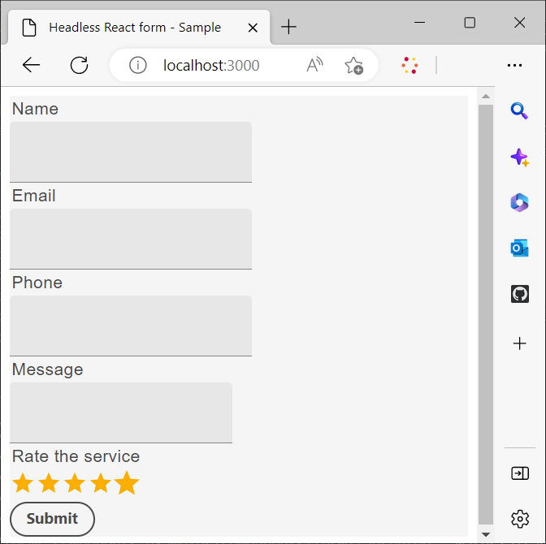
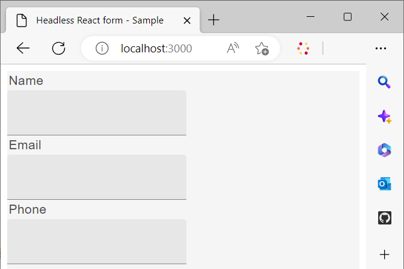

# Utilizzare una libreria di react personalizzata per eseguire il rendering di un modulo headless

Puoi creare e implementare componenti personalizzati per personalizzare l’aspetto e la funzionalità (Comportamento) dei moduli adattivi headless in base ai requisiti e alle linee guida della tua organizzazione.

Questi componenti hanno due finalità principali: controllare l’aspetto o lo stile dei campi modulo e memorizzare i dati raccolti attraverso questi campi all’interno dell’istanza del modello di modulo. Se questo può sembrare confuso, non preoccuparti: esploreremo questi scopi in modo più dettagliato a breve. Per il momento, concentriamoci sui passaggi iniziali della creazione di componenti personalizzati, del rendering del modulo utilizzando questi componenti e dell’utilizzo di eventi per salvare e inviare dati a un endpoint REST.

In questo tutorial, vengono utilizzati i componenti dell’interfaccia utente di Google Material per dimostrare come eseguire il rendering di un modulo adattivo headless utilizzando i componenti React personalizzati. Tuttavia, non sei limitato a questa libreria e sei libero di utilizzare qualsiasi libreria di componenti React o di sviluppare componenti personalizzati.

Con la conclusione di questo articolo, il _Contattaci_ modulo creato in [Creare e pubblicare un modulo headless con kit di avvio](create-and-publish-a-headless-form.md) L&#39;articolo si trasforma in:




I passaggi principali necessari per l’utilizzo dei componenti dell’interfaccia utente Materiale di Google per il rendering di un modulo sono i seguenti:


## 1. Installare l’interfaccia utente dei materiali di Google

Per impostazione predefinita, il kit di avvio utilizza [Spettro Adobe](https://spectrum.adobe.com/) componenti. Impostiamolo per l’utilizzo [Interfaccia utente Materiale di Google](https://mui.com/):

1. Verificare che il kit di avvio non sia in esecuzione. Per arrestare il kit di avvio, aprire il terminale, passare alla **react-starter-kit-aem-headless-forms**, e premere Ctrl-C (lo stesso avviene su Windows, Mac e Linux).

   Non tentare di chiudere il terminale. La chiusura del terminale non arresta il kit di avvio.

1. Esegui il comando seguente:

```shell
    
    npm install @mui/material @emotion/react @emotion/styled --force
    
```

Installa le librerie npm dell’interfaccia utente di Google Material e aggiunge le librerie alle dipendenze dei kit di avvio. È ora possibile utilizzare i componenti dell’interfaccia utente Materiale per eseguire il rendering dei componenti del modulo.


## 2. Creare componenti React personalizzati

Creiamo un componente personalizzato che sostituisca quello predefinito [immissione testo](https://spectrum.adobe.com/page/text-field/) componente con [Campo di testo interfaccia utente materiale Google](https://mui.com/material-ui/react-text-field/) componente.

Per ogni tipo di componente è necessario un componente separato ([fieldType](https://opensource.adobe.com/aem-forms-af-runtime/storybook/?path=/story/reference-json-properties-fieldtype--text-input) o :type) utilizzato in una definizione di modulo headless. Ad esempio, nel modulo Contattaci creato nella sezione precedente, i campi Nome, E-mail e Telefono di tipo `text-input` ([fieldType: &quot;text-input&quot;](https://opensource.adobe.com/aem-forms-af-runtime/storybook/?path=/docs/adaptive-form-components-text-input-field--def)) e il campo del messaggio è di tipo `multiline-input` ([&quot;fieldType&quot;: &quot;multiline-input&quot;](https://opensource.adobe.com/aem-forms-af-runtime/storybook/?path=/docs/reference-json-properties-fieldtype--multiline-input)).


Creiamo un componente personalizzato per sovrapporre tutti i campi modulo che utilizzano [fieldType: &quot;text-input&quot;](https://opensource.adobe.com/aem-forms-af-runtime/storybook/?path=/docs/adaptive-form-components-text-input-field--def) proprietà con [Campo di testo interfaccia utente materiale](https://mui.com/material-ui/react-text-field/) componente.


Per creare il componente personalizzato e mappare il componente personalizzato con [fieldType](https://opensource.adobe.com/aem-forms-af-runtime/storybook/?path=/docs/adaptive-form-components-text-input-field--def) proprietà:

1. Apri **react-starter-kit-aem-headless-forms** in un editor di codice e passare a `\react-starter-kit-aem-headless-forms\src\components`.


1. Crea una copia di **cursore** o **richtext** e rinominare la cartella copiata in **materialtextfield**. Slider e richtext sono due esempi di componenti personalizzati disponibili nell’app iniziale. Puoi utilizzarli per creare componenti personalizzati.

   

1. Apri `\react-starter-kit-aem-headless-forms\src\components\materialtextfield\index.tsx` e sostituire il codice esistente con il codice seguente. Questo codice restituisce ed esegue il rendering di un [Campo di testo interfaccia utente materiale Google](https://mui.com/material-ui/react-text-field/) componente.

```JavaScript
 
     import React from 'react';
     import {useRuleEngine} from '@aemforms/af-react-renderer';
     import {FieldJson, State} from '@aemforms/af-core';
     import { TextField } from '@mui/material';
     import Box from '@mui/material/Box';
     import { richTextString } from '@aemforms/af-react-components';
     import Typography from '@mui/material/Typography';


     const MaterialtextField = function (props: State<FieldJson>) {

         const [state, handlers] = useRuleEngine(props);

         return(

         <Box>
             <Typography component="legend">{state.visible ? richTextString(state?.label?.value): ""} </Typography>
             <TextField variant="filled"/>
         </Box>

         )
     }

     export default MaterialtextField;
```


Il `state.visible` la parte controlla se il componente è impostato per essere visibile. In caso affermativo, l’etichetta del campo viene recuperata e visualizzata utilizzando `richTextString(state?.label?.value)`.


Il componente personalizzato `materialtextfield` è pronto. Impostiamo questo componente personalizzato per sostituire tutte le istanze di  [fieldType: &quot;text-input&quot;](https://opensource.adobe.com/aem-forms-af-runtime/storybook/?path=/docs/adaptive-form-components-text-input-field--def) con il campo di testo dell’interfaccia utente Materiale di Google.

## 3. Mappatura del componente personalizzato con campi modulo headless

Il processo di utilizzo di componenti libreria di terze parti per il rendering dei campi modulo è noto come mappatura. Mappatura di ciascuna ([fieldType](https://opensource.adobe.com/aem-forms-af-runtime/storybook/?path=/story/reference-json-properties-fieldtype--text-input)) al componente corrispondente della libreria di terze parti.

Tutte le informazioni relative alla mappatura vengono aggiunte al `mappings.ts` file. Il `...mappings` dichiarazione nella `mappings.ts` file fa riferimento alle mappature predefinite, che sovrappongono il file ([fieldType](https://opensource.adobe.com/aem-forms-af-runtime/storybook/?path=/story/reference-json-properties-fieldtype--text-input) o :type) con [Spettro Adobe](https://spectrum.adobe.com/page/text-field/) componenti.

Per aggiungere la mappatura per  `materialtextfield` componente, creato nell&#39;ultimo passaggio:

1. Apri `mappings.ts` file.

1. Aggiungi la seguente istruzione di importazione per includere `materialtextfield` componente per `mappings.ts` file:


   ```JavaScript
       import MaterialtextField from "../components/materialtextfield";
   ```

1. Aggiungi la seguente istruzione per mappare `text-input` con il componente materialtextfield.


   ```JavaScript
       "text-input": MaterialtextField
   ```

   Il codice finale del file è simile al seguente:

   ```JavaScript
         import { mappings } from "@aemforms/af-react-components";
         import MaterialtextField from "../components/materialtextfield";
   
   
         const customMappings: any = {
           ...mappings,
           "text-input": MaterialtextField
        };
        export default customMappings;
   ```

1. Salva ed esegui l’app. I primi tre campi del modulo vengono visualizzati utilizzando [Campo di testo interfaccia utente materiale Google](https://mui.com/material-ui/react-text-field/):

   


   Allo stesso modo, puoi creare componenti personalizzati per i campi messaggio (&quot;fieldType&quot;: &quot;multi-line-input&quot;) e valutazione del servizio (&quot;fieldType&quot;: &quot;number-input&quot;). Puoi clonare il seguente archivio Git per i componenti personalizzati del messaggio e valutare i campi del servizio:

   [https://github.com/singhkh/react-starter-kit-aem-headless-forms](https://github.com/singhkh/react-starter-kit-aem-headless-forms)

## Passaggio successivo

Il rendering del modulo con i componenti personalizzati che utilizzano l’interfaccia utente Materiale di Google è stato eseguito correttamente. Hai provato a inviare il modulo facendo clic sul pulsante Invia (mappato con il componente corrispondente dell’interfaccia utente di Google Material)? In caso contrario, prova.

Il modulo invia i dati a un&#39;origine dati? No? Non preoccuparti. Questo perché il modulo non è configurato per comunicare con la libreria runtime.

Come configurare il modulo per comunicare con esso? Presto sarà disponibile un articolo che spiegherà tutto nel dettaglio. Continua a seguirci!
